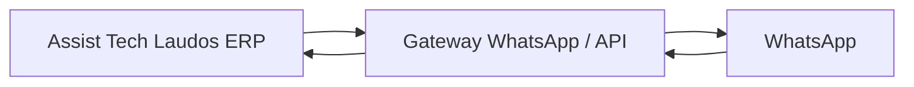

# Plano de integração WhatsApp – POC inicial

## 1. Comparação rápida das opções

### Recomendação inicial
A melhor opção para o primeiro POC é a opção B: usar um gateway/API externo (por exemplo, Evolution API, WAHA ou WPPConnect).

Motivo: é o caminho mais simples, estável e seguro para começar sem depender de uma sessão web local e sem criar muita complexidade operacional no backend.

### Comparação

| Opção | Prós | Contras | Requisitos | Encaixe com Channel / Conversation / Message |
|---|---|---|---|---|
| A. whatsapp-web.js direto | Mais barato no início; controle total sobre o fluxo | Menos estável; depende de sessão web; risco de bloqueios; mais manutenção | Backend com processo contínuo, credenciais, monitoramento, fallback | Funciona, mas exige mais cuidado para manter a sessão viva e sincronizar eventos |
| B. Gateway/API externo | Mais estável; menos manutenção; webhook e rastreio prontos; fácil de operar | Custo mensal; dependência de fornecedor | Conta/credencial do gateway, webhooks, ambiente seguro, logs | Muito alinhado: o ERP recebe inbound/outbound e grava tudo em Conversation/Message |
| C. CRM open-source (Wacrm/Chatwoot) | Boa experiência operacional e histórico de atendimento | Mais complexo; mais componentes para manter; mais infraestrutura | Servidor, banco, integração Meta Cloud, manutenção | Boa opção para crescimento, mas pesada para o primeiro POC |

## 2. Fluxos iniciais de WhatsApp

### Fluxo 1 – Cliente inicia conversa
1. O cliente manda uma mensagem pelo WhatsApp.
2. O gateway envia o evento para o ERP.
3. O ERP cria ou atualiza uma Conversation para esse número.
4. O ERP cria uma OS mínima ou associa a uma OS existente, se houver correspondência pelo telefone.
5. O ERP responde com uma mensagem inicial simples.

### Fluxo 2 – Técnico finaliza OS
1. Ao fechar uma OS e gerar o laudo, o ERP prepara um resumo curto.
2. O ERP envia esse resumo via gateway para o cliente.
3. A mensagem inclui resumo curto do atendimento e link do laudo.
4. O ERP registra a mensagem como outbound na Conversation.

### Fluxo 3 – Cliente responde com foto (opcional)
1. O cliente envia uma foto.
2. O gateway informa o evento ao ERP.
3. O ERP salva a mídia como anexo e associa à OS/laudo correspondente.
4. A mensagem entra como evento na Conversation e pode ser usada para complementar o laudo.

## 3. Arquitetura alvo mínima

### O que o ERP precisa expor e consumir

#### Endpoints do ERP
- POST /communications/webhook/inbound: recebe mensagens recebidas do gateway.
- POST /communications/webhook/status: recebe status de entrega/envio.
- POST /communications/messages/outbound: envia mensagens para o cliente.
- GET /conversations/by-phone/:phone: consulta ou cria Conversation pelo telefone.
- POST /service-orders/whatsapp/initiate: cria uma OS mínima a partir de uma conversa.

#### Webhooks esperados do gateway
- inbound_message
- message_status
- message_received
- webhook_error

#### Mapeamento de telefone para cliente/Conversation
- Normalizar o número para um padrão único.
- Buscar por Client pelo telefone cadastrado.
- Se não houver Client, criar uma Conversation pendente com contexto mínimo.
- Associar a Conversation à OS, se existir uma ordem relacionada.

## 4. Escopo do primeiro POC

### Opção escolhida
B. Gateway/API externo.

### O que entra no POC
- Receber mensagens de texto pelo WhatsApp.
- Criar ou atualizar Conversation.
- Criar ou associar uma OS mínima ao contato.
- Enviar um resumo curto de atendimento com link do laudo.
- Registrar mensagens inbound/outbound no modelo existente de Message.

### O que não entra no POC
- Broadcast/campanhas.
- Automação avançada de IA.
- Mídia complexa ou anexos pesados além de uma foto simples.
- Atendimento multiagente em tempo real.
- Integração completa com CRM ou painel operacional.

## 5. Impactos mínimos em backend e infra

- Adicionar um módulo pequeno de comunicação no backend.
- Expor endpoints de webhook e outbound.
- Persistir inbound/outbound em Channel, Conversation e Message.
- Manter o fluxo principal de OS/laudo intacto.
- Usar variáveis de ambiente para credenciais e URLs do gateway.
- Priorizar logs simples e rastreio de status para reduzir risco operacional.

## 6. Resumo prático da decisão

Para um primeiro passo de baixo risco, o melhor caminho é:
- usar um gateway/API externo,
- integrar com o modelo atual de Channel/Conversation/Message,
- começar com envio e recebimento de texto,
- e evoluir depois para mídia, automações e histórico mais rico.
